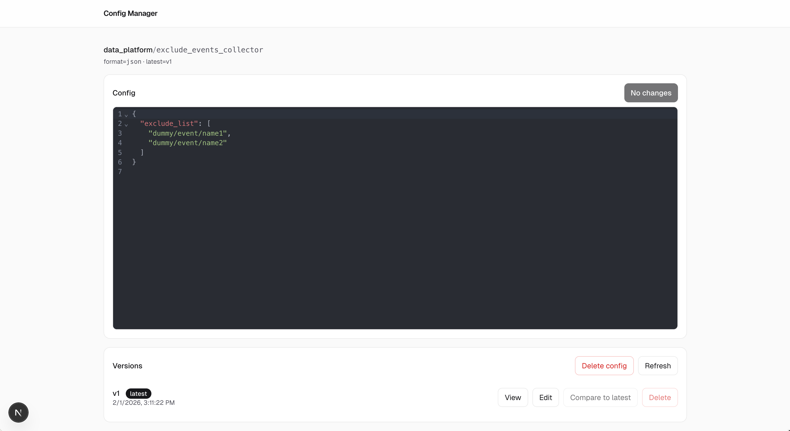
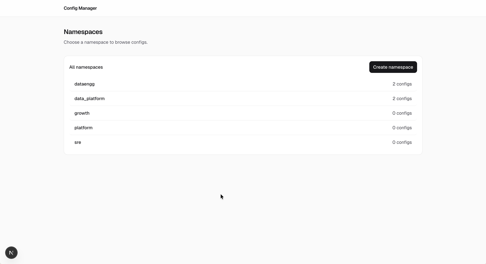
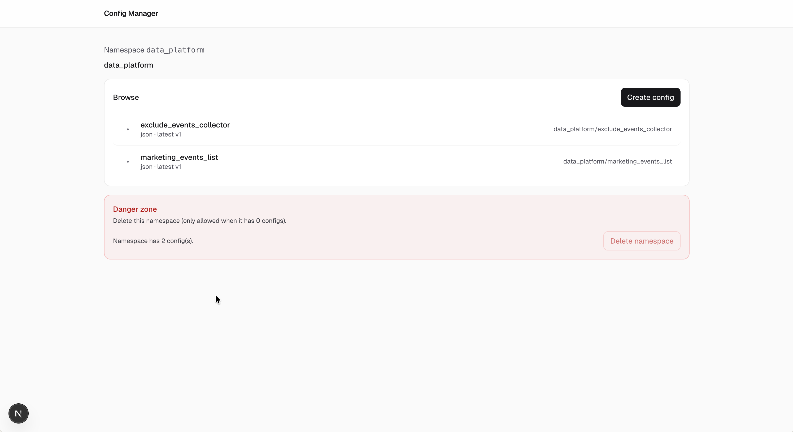

# Config Manager

Config Manager is a powerful, open source platform for managing and versioning configuration data at scale. It features a Postgres-backed registry with immutable versioning, a modern web UI for browsing and editing configs with audit history.



## Screenshots

<details>
<summary>Namespace list</summary>



</details>

<details>
<summary>Config list</summary>



</details>

<details>
<summary>Config editor</summary>


</details>

<details>
<summary>Compare versions</summary>


</details>

## Quickstart

```bash
make db-up
make db-apply
make api-run
```

In a second terminal:

```bash
make ui-install
make ui-dev
```

Open the UI at `http://localhost:3000` (API is `http://localhost:8080`).

## Docs

- [`api/openapi.yaml`](api/openapi.yaml): API contract (source of truth)
- Postman tip: import [`api/openapi.yaml`](api/openapi.yaml) to generate a collection (see [`docs/development.md`](docs/development.md))
- [`docs/architecture.md`](docs/architecture.md): architecture + versioning model
- [`docs/development.md`](docs/development.md): local workflow
- [`docs/deployment.md`](docs/deployment.md): production notes + checklist
- [`docs/environment-variables.md`](docs/environment-variables.md): all env vars
- [`docs/packaging.md`](docs/packaging.md): Docker/Helm packaging + release notes
- [`CONTRIBUTING.md`](CONTRIBUTING.md): contributor workflow and conventions

## Common commands

- `make help`: list all targets
- `make check`: backend tests + UI lint/typecheck
- `make smoke`: quick API smoke test
- `make db-reset`: reset local Postgres volume