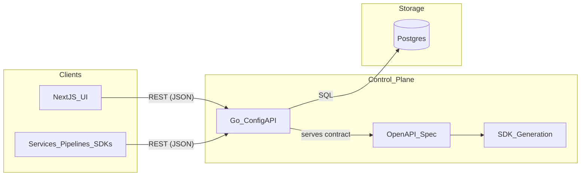
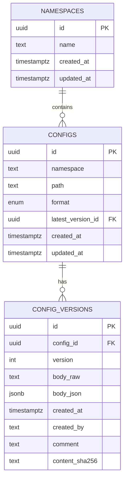
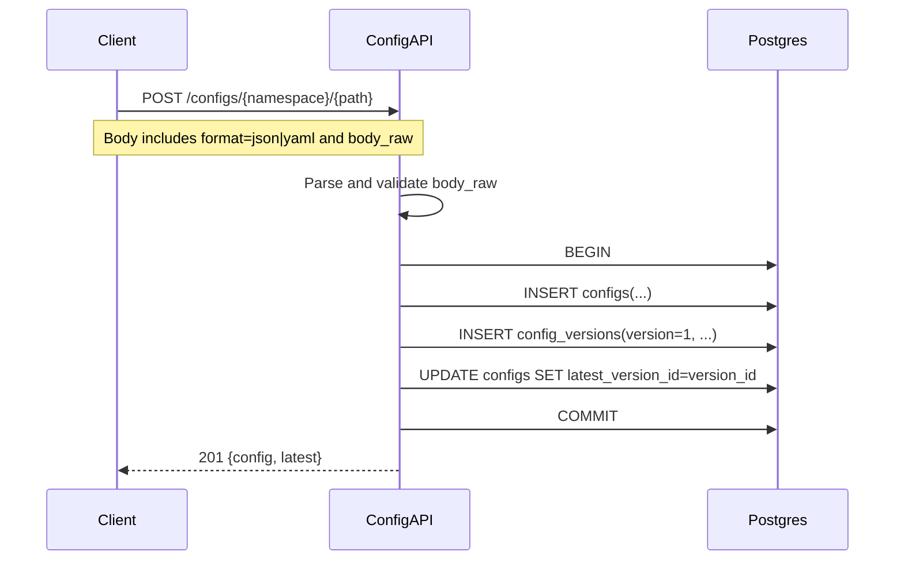
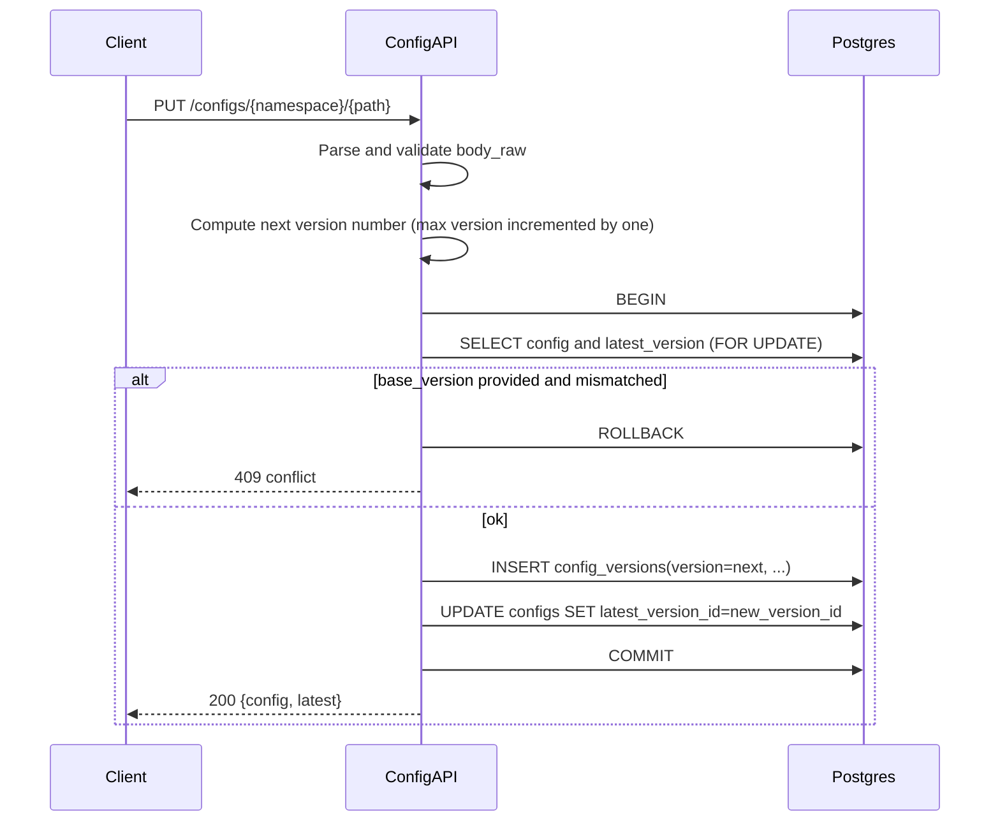

# Config Manager Architecture (v1)

This document describes the initial architecture, data flow, and versioning model.

## Core idea

- A **namespace** is an explicit container you can create even with 0 configs.
- A **logical config** is addressed like a folder path: `/configs/{namespace}/{path}`
- The UI path mirrors the API path (namespace + folder-like path) and offers Vault-like browsing.
- Each change creates an **immutable version**
- **Latest** is always the most recently saved version (i.e. the maximum version number).

Identity is **(namespace, path)**. `format` is an attribute of the config (either JSON or YAML, never both for the same identity).

## High-level component diagram

## Postgres model (conceptual)

## Versioning semantics

- `config_versions` rows are **append-only**.
- **Latest is derived**: \(latest == max(version)\) for a given config.
- Creating a new version increments from the current max version and becomes latest.
- The API forbids deleting the latest version.
- There is **no “make latest”** action. Promoting an older version means saving it again as a new version.

### Why `configs.latest_version_id` exists if latest is derived

We still store `configs.latest_version_id` as a convenience pointer for fast reads, but it is **not client-controlled**:

- The service always advances it to the newly-created version.
- The DB enforces that it always points to a version belonging to the same config.

## Data flow: create config

## Data flow: update config (new version)

## Promoting an older version (immutable)

To “promote” an older version, clients should:
- View an older version
- Load it into the editor
- Save it as a **new version** (which becomes latest)

## Deletion semantics (hard delete)

This service uses hard deletes with safety constraints:

- **Delete a config version**: `DELETE /configs/{namespace}/{path}/versions/{version}`
  - Allowed for non-latest versions only.
  - Attempting to delete the current latest returns **409 Conflict**.
- **Delete an entire config** (cascades all versions): `DELETE /configs/{namespace}/{path}`
  - Deletes the `configs` row and all `config_versions` (via `ON DELETE CASCADE`).
- **Delete a namespace**: `DELETE /namespaces/{namespace}`
  - Only allowed when the namespace contains **0 configs**.
  - Otherwise returns **409 Conflict**.

## UI compare/diff workflow (versions)

The UI supports comparing versions with diff highlighting to help users reason about changes:

- Users can open a compare view (including “compare to latest” shortcuts).
- Both sides are editable.
- Clicking **Save new version** on either side creates a **new immutable version** from that panel’s content (becoming latest).

## Future: viewer vs developer roles

See `docs/rbac.md` for how we’ll introduce read-only vs write access (API + UI) without breaking the URL/path model.

## SDK strategy (future)

- Treat `api/openapi.yaml` as the **source of truth**.
- Generate client SDKs (Go/Python/Scala) from OpenAPI.
- If a generated client is not idiomatic, keep a thin wrapper to expose a stable, friendly surface to pipelines/services.

