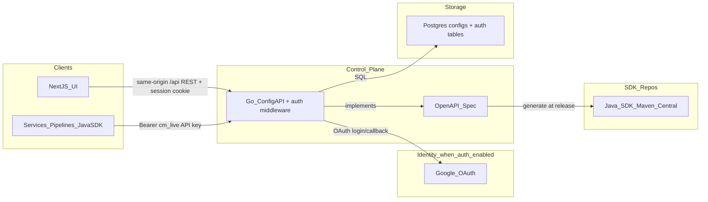
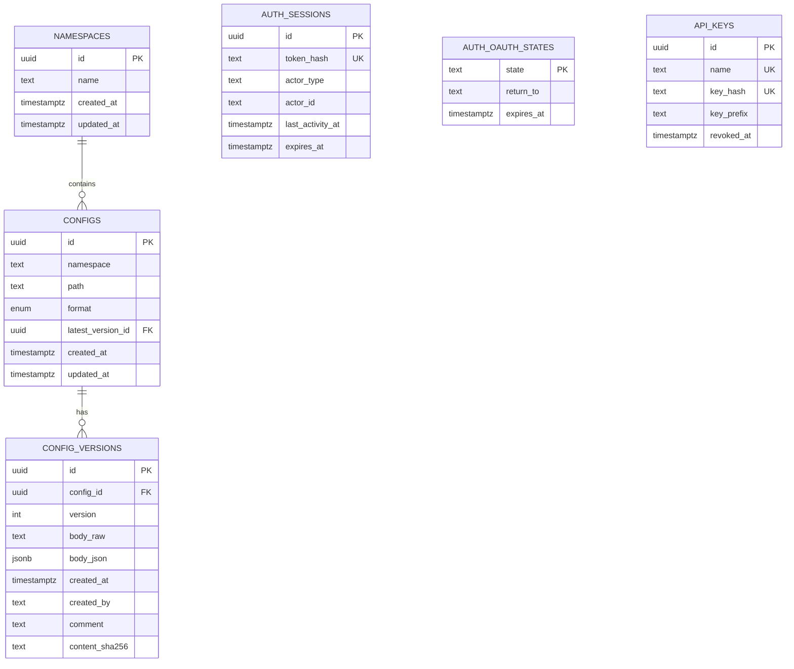
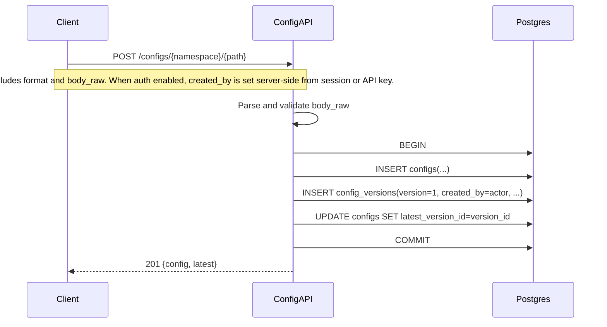
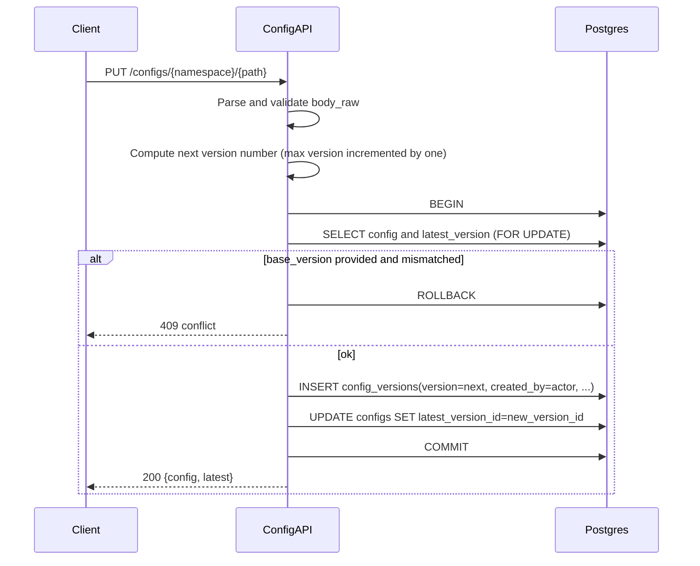
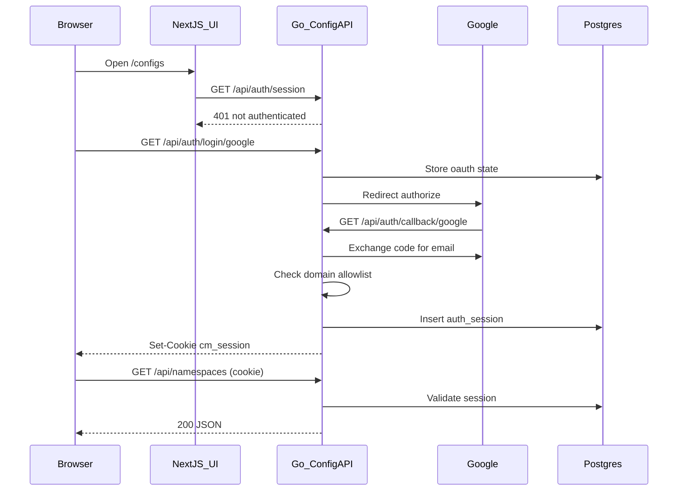
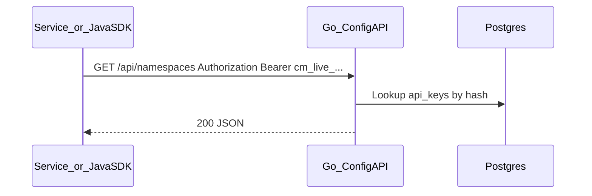

# Config Manager Architecture (v1)

This document describes the initial architecture, data flow, and versioning model.

## Core idea

- A **namespace** is an explicit container you can create even with 0 configs.
- A **logical config** is addressed like a folder path: `/configs/{namespace}/{path}`
- Path examples assume the API root; when `HTTP_BASE_PATH` is set (e.g. `/api`), prefix routes (see [environment-variables.md](environment-variables.md)).
- The UI path mirrors the API path (namespace + folder-like path) and offers Vault-like browsing.
- Each change creates an **immutable version**
- **Latest** is always the most recently saved version (i.e. the maximum version number).

Identity is **(namespace, path)**. `format` is an attribute of the config (either JSON or YAML, never both for the same identity).

Namespace/name validation allows letters, digits, underscore, and hyphen: `^[a-zA-Z0-9_-]+$`.

## High-level component diagram

```mermaid
flowchart LR
  subgraph clients [Clients]
    BrowserUI[NextJS_UI]
    Services[Services_Pipelines_JavaSDK]
  end

  subgraph identity [Identity_when_auth_enabled]
    Google[Google_OAuth]
  end

  subgraph controlPlane [Control_Plane]
    ApiService["Go_ConfigAPI + auth middleware"]
    OpenAPI[OpenAPI_Spec]
  end

  subgraph sdkRepos [SDK_Repos]
    JavaSDK[Java_SDK_Maven_Central]
  end

  subgraph storage [Storage]
    Postgres["Postgres configs + auth tables"]
  end

  BrowserUI -->|"same-origin /api REST + session cookie"| ApiService
  Services -->|"Bearer cm_live API key"| ApiService
  ApiService -->|"OAuth login/callback"| Google
  ApiService -->|"SQL"| Postgres

  OpenAPI -->|"generate at release"| JavaSDK
  ApiService -->|"implements"| OpenAPI
```

Production routing (recommended): ingress sends `/` to the UI and `/api/*` to the Go API on one host. The UI proxies `/api/*` only in local dev.

The API contract is [`api/openapi.yaml`](../api/openapi.yaml) in the repo (tooling/SDKs); the running service does not host that file over HTTP.

## Postgres model (conceptual)

```mermaid
erDiagram
  NAMESPACES ||--o{ CONFIGS : contains
  CONFIGS ||--o{ CONFIG_VERSIONS : has

  NAMESPACES {
    uuid id PK
    text name
    timestamptz created_at
    timestamptz updated_at
  }

  CONFIGS {
    uuid id PK
    text namespace
    text path
    enum format
    uuid latest_version_id FK
    timestamptz created_at
    timestamptz updated_at
  }

  CONFIG_VERSIONS {
    uuid id PK
    uuid config_id FK
    int version
    text body_raw
    jsonb body_json
    timestamptz created_at
    text created_by
    text comment
    text content_sha256
  }

  AUTH_SESSIONS {
    uuid id PK
    text token_hash UK
    text actor_type
    text actor_id
    timestamptz last_activity_at
    timestamptz expires_at
  }

  AUTH_OAUTH_STATES {
    text state PK
    text return_to
    timestamptz expires_at
  }

  API_KEYS {
    uuid id PK
    text name UK
    text key_hash UK
    text key_prefix
    timestamptz revoked_at
  }
```

Config data (`namespaces`, `configs`, `config_versions`) is separate from auth data (`auth_sessions`, `auth_oauth_states`, `api_keys`, migration `000003_auth`).

## Versioning semantics

- `config_versions` rows are **append-only**.
- **Latest is derived**: \(latest == max(version)\) for a given config.
- Creating a new version increments from the current max version and becomes latest.
- The API forbids deleting the latest version.
- There is **no “make latest”** action. Promoting an older version means saving it again as a new version.

### Why `configs.latest_version_id` exists if latest is derived

We still store `configs.latest_version_id` as a convenience pointer for fast reads, but it is **not client-controlled**:

- The service always advances it to the newly-created version.
- The DB enforces that it always points to a version belonging to the same config.

## Data flow: create config

```mermaid
sequenceDiagram
participant C as Client
participant A as ConfigAPI
participant P as Postgres

C->>A: POST /configs/{namespace}/{path}
note over C,A: Body includes format and body_raw. When auth enabled, created_by is set server-side from session or API key.
A->>A: Parse and validate body_raw
A->>P: BEGIN
A->>P: INSERT configs(...)
A->>P: INSERT config_versions(version=1, created_by=actor, ...)
A->>P: UPDATE configs SET latest_version_id=version_id
A->>P: COMMIT
A-->>C: 201 {config, latest}
```

## Data flow: update config (new version)

```mermaid
sequenceDiagram
participant C as Client
participant A as ConfigAPI
participant P as Postgres

C->>A: PUT /configs/{namespace}/{path}
A->>A: Parse and validate body_raw
A->>A: Compute next version number (max version incremented by one)
A->>P: BEGIN
A->>P: SELECT config and latest_version (FOR UPDATE)
alt base_version provided and mismatched
  A->>P: ROLLBACK
  A-->>C: 409 conflict
else ok
  A->>P: INSERT config_versions(version=next, created_by=actor, ...)
  A->>P: UPDATE configs SET latest_version_id=new_version_id
  A->>P: COMMIT
  A-->>C: 200 {config, latest}
end
```

## Promoting an older version (immutable)

To “promote” an older version, clients should:
- View an older version
- Load it into the editor
- Save it as a **new version** (which becomes latest)

## Deletion semantics

This service uses a mix of hard deletes and safety constraints:

- **Delete a config version**: `DELETE /configs/{namespace}/{path}/versions/{version}`
  - Allowed for non-latest versions only.
  - Attempting to delete the current latest returns **409 Conflict**.
- **Delete an entire config**: `DELETE /configs/{namespace}/{path}`
  - Hard-deletes the config and its versions.
- **Delete a namespace**: `DELETE /namespaces/{namespace}`
  - Only allowed when the namespace contains **0 configs**.
  - Otherwise returns **409 Conflict**.

## UI compare/diff workflow (versions)

The UI supports comparing versions with diff highlighting to help users reason about changes:

- Users can open a compare view (including “compare to latest” shortcuts).
- Both sides are editable.
- Clicking **Save new version** on either side creates a **new immutable version** from that panel’s content (becoming latest).

## Authentication (v1)

When `auth.enabled=true` (default is `false` for local dev):

- **Browser users** sign in via Google OAuth (`GET /auth/login/google`), receive an httpOnly session cookie, and call `/api/*` same-origin.
- **Machine clients** (Java SDK, pipelines) use API keys: `Authorization: Bearer cm_live_...`.
- Auth middleware runs on all routes except health checks and OAuth login/callback/session/logout.
- `created_by` on config versions is set server-side from the authenticated identity (email or `apikey:<name>`).

See [auth.md](auth.md) for setup. Role-based access (viewer vs developer) is planned for v2 — see [rbac.md](rbac.md).

### Browser login flow

```mermaid
sequenceDiagram
  participant B as Browser
  participant U as NextJS_UI
  participant A as Go_ConfigAPI
  participant G as Google
  participant P as Postgres

  B->>U: Open /configs
  U->>A: GET /api/auth/session
  A-->>U: 401 not authenticated
  B->>A: GET /api/auth/login/google
  A->>P: Store oauth state
  A->>G: Redirect authorize
  G->>A: GET /api/auth/callback/google
  A->>G: Exchange code for email
  A->>A: Check domain allowlist
  A->>P: Insert auth_session
  A-->>B: Set-Cookie cm_session
  B->>A: GET /api/namespaces (cookie)
  A->>P: Validate session
  A-->>B: 200 JSON
```

### Machine client flow

```mermaid
sequenceDiagram
  participant S as Service_or_JavaSDK
  participant A as Go_ConfigAPI
  participant P as Postgres

  S->>A: GET /api/namespaces Authorization Bearer cm_live_...
  A->>P: Lookup api_keys by hash
  A-->>S: 200 JSON
```

## RBAC v2 (planned)

See [rbac.md](rbac.md) for planned read-only vs write access (API + UI) without changing the URL model.

## SDK strategy

- Treat `api/openapi.yaml` as the **source of truth** for all generated clients. Bump `info.version` when the contract changes in a client-visible way.
- **Java SDK** ([config-manager-java-sdk](https://github.com/arverma/config-manager-java-sdk), `io.github.arverma:config-manager-java-sdk` on Maven Central) is generated from a **pinned OpenAPI ref** at SDK release time; SDK semver is **independent** of server tags. See the SDK [compatibility matrix](https://github.com/arverma/config-manager-java-sdk/blob/main/COMPATIBILITY.md).
- Machine clients pass API keys via `ApiClient.setRequestInterceptor` (see SDK README).
- **Go/Python** clients remain future work in-repo or as separate repos.
- If a generated client is not idiomatic, keep a thin wrapper to expose a stable surface to pipelines/services.

